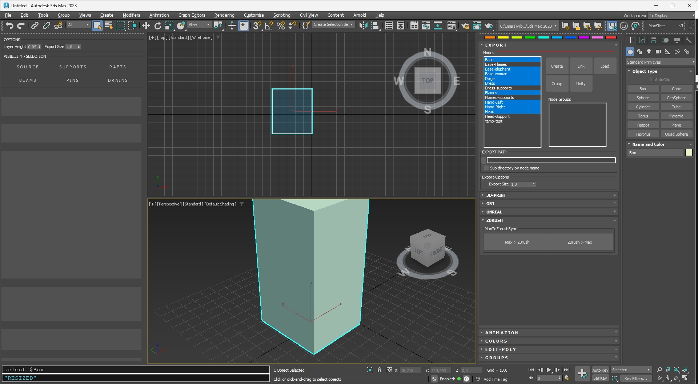

# MaxSlicer

### Set of 3D print tools for 3Ds Max  

## Features

- Slice object per print layer  
- Search for new islands 

- Generate print helpers:  
	- **SUPPORTS**  
	- **RAFTS**  
	- **DRAIN HOLES**  
	- **CONNECT PINS**  

- **Live update** of supports when position of model is changed  
- Manage visibility and selection of print helpers

- Use vertex colors for placing of supports

## UI

# IMPORTANT - DEPENDENCY

This plugin depends on [MAXSCRIPT-UI-framework](https://github.com/vilbur/MAXSCRIPT-UI-framework)